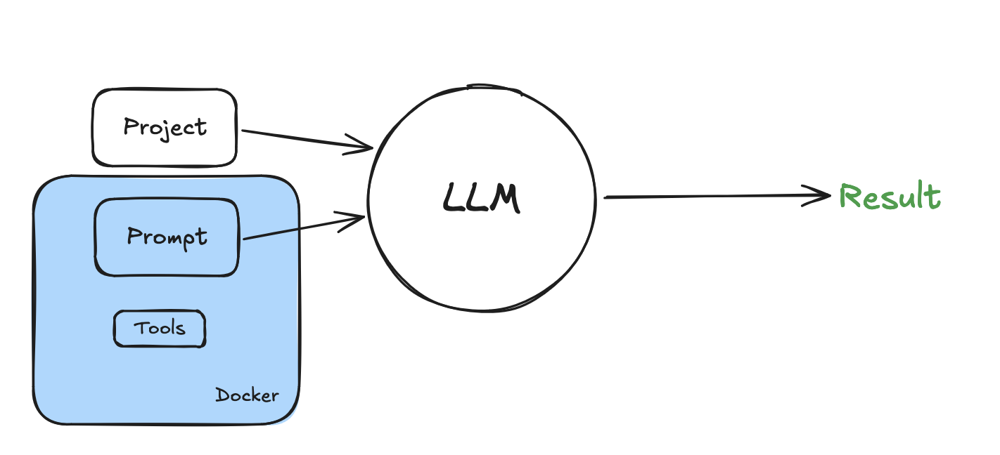
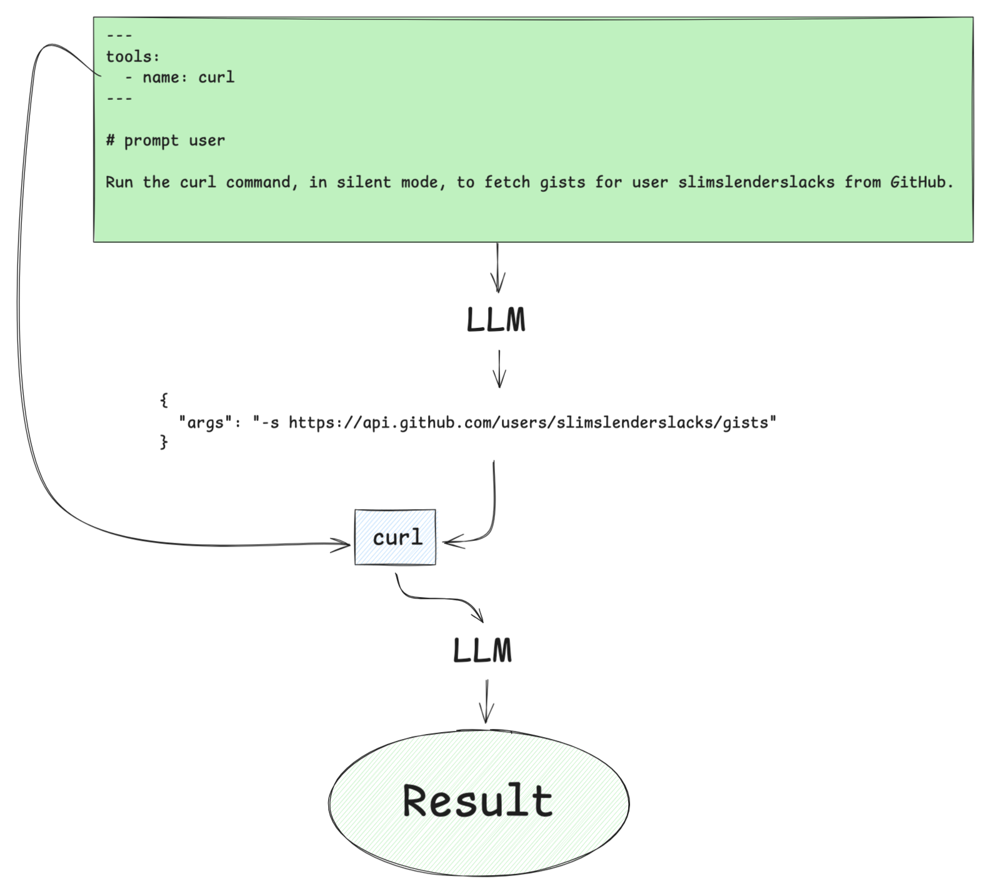

# AI Tools for Developers

Agentic AI workflows enabled by Docker containers.



Source for many experiments in our [LinkedIn newsletter](https://www.linkedin.com/newsletters/docker-labs-genai-7204877599427194882/)

Docker Desktop Extension: https://hub.docker.com/extensions/docker/labs-ai-tools-for-devs

VSCode Extension: https://github.com/docker/labs-make-runbook

# What is this?

## Project-First Design
To get help from an assistant in your software development loop, the only context necessary is the project you are working on. 

### Extracting project context


An extractor is a Docker image that runs against a project and extracts information into a JSON context.

## Prompts as a trackable artifact


Prompts are stored in a git repo and can be versioned, tracked, and shared. 

## Dockerized Tools


OpenAI API compatiable LLM's already support function calling. This is our workbench to test the same spec, but with functions as Docker images. Some of the benefits using Docker based on our [research](https://www.linkedin.com/newsletters/docker-labs-genai-7204877599427194882/) are enabling the LLM to: 
- take more complex actions
- deliver relevant context to the LLM without too many tokens
- work across a wider range of environments
- operate in a sandboxed environment

# Get Started

## Running a Conversation Loop

Set OpenAI key
```sh
echo $OPENAI_API_KEY > $HOME/.openai-api-key
```
Run
```sh
docker run 
  --rm \
  --pull=always \
  -it \
  -v /var/run/docker.sock:/var/run/docker.sock \
  --mount type=volume,source=docker-prompts,target=/prompts \
  --mount type=bind,source=$HOME/.openai-api-key,target=/root/.openai-api-key \
  vonwig/prompts:latest \
    run \
    --host-dir $PWD \
    --user $USER \
    --platform "$(uname -o)" \
    --prompts "github:docker/labs-githooks?ref=main&path=prompts/git_hooks"
```

See [docs](https://vonwig.github.io/prompts.docs/#/page/running%20the%20prompt%20engine) for more details on how to run the conversation loop, 
and especially how to use it to run local prompts that are not yet in GitHub.

[PROMPTS KNOWLEDGE GRAPH](https://vonwig.github.io/prompts.docs/#/page/index)

## Building

```sh
#docker:command=build

docker build -t vonwig/prompts:local -f Dockerfile .
```

