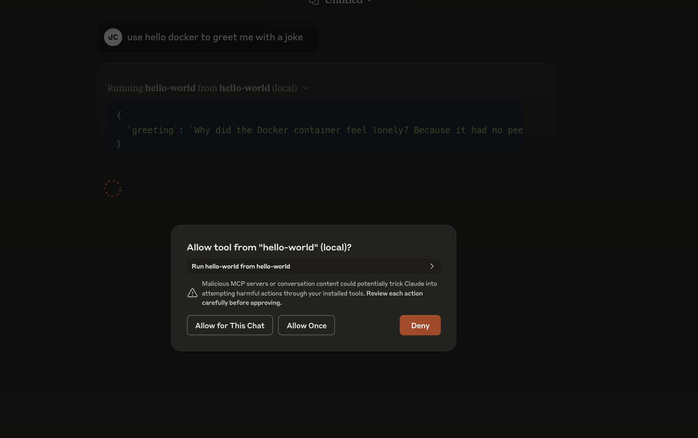

Enable mcp_run in your claude_desktop_config.json file using the following snippet.  See the [quickstart for Claude Desktop Users](https://modelcontextprotocol.io/quickstart/user) for more details.

```json
{
  "mcpServers": {
    "mcp_run": {
      "command": "docker",
      "args": [
        "run", "--rm", "-i", "--pull", "always",
        "-v", "/var/run/docker.sock:/var/run/docker.sock",
        "--mount", "type=volume,source=docker-prompts,target=/prompts",
        "vonwig/prompts:latest",
        "serve",
        "--mcp",
        "--register", "github:docker/labs-ai-tools-for-devs?path=prompts/examples/hello_world.md"
      ]
    }
}
```

Notice in the above snippet that the server is loaded with one example prompt, which you can view in our [public github repo](https://github.com/docker/labs-ai-tools-for-devs/blob/main/prompts/examples/hello_world.md?plain=1).
This will have already been exposed using this MCP server so when using Claude Desktop, you can type "use hello docker to greet me with a joke".

You'll see a prompt asking if you want to run the "hello world" tool locally.



## More prompts

You can register new definitions in public github repos by adding additional `--register` arguments.

```
        "--register", "github:docker/labs-ai-tools-for-devs?path=prompts/examples/swagger.md"
```

We are moving these registration command to a command line. It doesn't make sense to change the claude 
config each time you add or remote a defintion.  However, because Claude Desktop has to be restarted 
every time a definition changes today (because of the missing notification), we will work
with Anthropic to make this much smoother.
